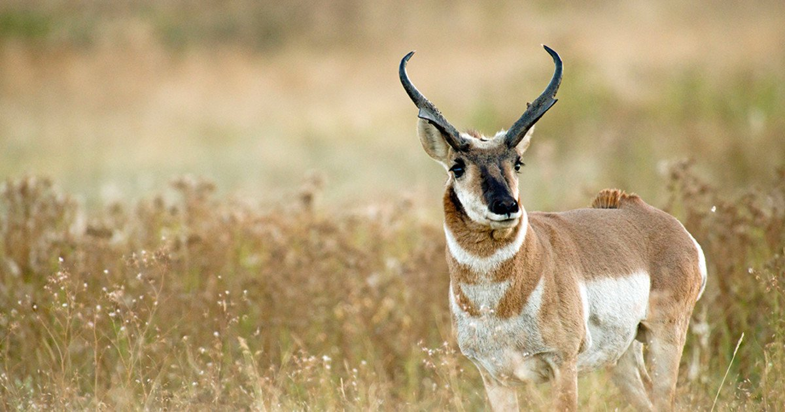
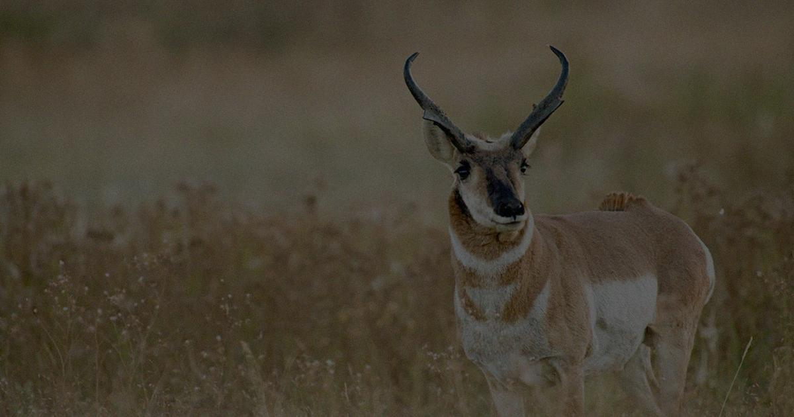
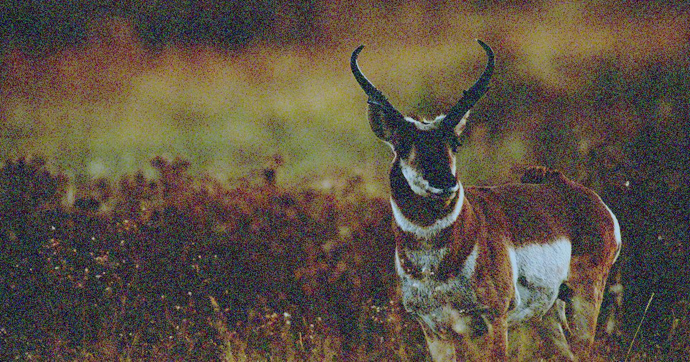
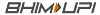
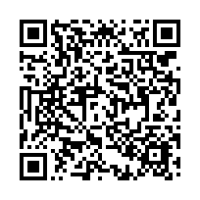

# maet-low-light-transform

Credit to dataset : https://www.kaggle.com/datasets/iamsouravbanerjee/animal-image-dataset-90-different-animals?resource=download

Just download above dataset and copy the final animals folder to this repos root directory to run the provided script.

Mediafire direct download link : https://www.mediafire.com/file/eqae2avnvszrqy5/animals.7z/file (Link expires on 22 Feb, 2025)

Credit to ChatGPT for helping out with different aspects of this project.

A library to convert normal day-time/bright images to low light images.

Here we consider the input images to be RAW image even though they are stored in jpg format

## Usage

First install required library.
```
pip install -r requirements.txt
```
Then extract animals.7z in the repo directory

If you have some other directory just update the directory input and output directory in the scripts.


Then run either of the two conversions:

1) convert2lowlight.py: Performs below three steps.
    
    1) Exposure degradation (default value = `0.3`)
    2) Apply gamma correction (default value = `0.8`)
    3) Add Gaussian noise (default value = `0.02`)

2) low_light_corrupt.py: Convert sRGB images to low light images.(Detailed in https://github.com/cuiziteng/ICCV_MAET) Performs the following operations almost similar to reference mentioned as described below:
    
    1) invert tone mapping (using an approximation of inverse Reinhard function. Uses Reinhard approximation: `I' = I^2.2`)
    2) invert gamma correction (default value = `0.8`)
    3) invert sRGB to cRGB (where value of pixel is less than 0.04045, perform `pixel = (pixel / 12.92)`, else  `pixel = ((pixel + 0.055) / 1.055)^ 2.4)`)
    4) invert white balance (default wb matrix = `[1.5, 1.0, 0.8]`)
    5) Perform low light corruption:
        
        1) Reduce brightness (default value = `0.3`)
        2) Apply gamma correction (default value = `0.8`)
        3) Add Gaussian noise (default value = `0.02`)
    6) Perform quantisation of image (apply quantization to reduce color depth)
    7) Perform white balancing (default wb matrix = `[1.5, 1.0, 0.8]`)
    8) cRGB to sRGB conversion (where value of pixel is less than 0.0031308, perform `pixel = (pixel * 12.92)`, else `pixel = (1.055 * (pixel ^ ( 1 / 2.4)) - 0.055)`)
    9) Gamma correction (default value = `(1/0.8)`)


## Sample Input and Output

### Original:



### convert2lowlight (this repo implementation)



### ICCV_MAET (this repo implementation):




## Donation

If my projects helped you save your time. You can give me a cup of coffee. :)

You can donate me via BHIM UPI


.jpg)


Scan this QR Code to open your UPI Payment App or click on the upi logo

[](upi://pay?pn=Subrata%20Sarakar&pa=9002824700%40upi&tn=Donation&am=&cu=INR&url=http%3A%2F%2Fupi.link%2F)

